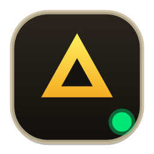

# ⚡ AGY RIG

<p align="center">
  
</p>

<p align="center">
  <strong>Universal Multi-Account Rig, Parallel Instance Manager & Live Quota Engine for Google Antigravity (AGY)</strong><br />
  Cross-platform support for Windows, macOS, and Linux.
</p>

<p align="center">
  
  
  
  
</p>

---

## ⚡ Quick Start / One-Liner Installers

### Windows (PowerShell)
Open PowerShell and run:
```powershell
irm https://raw.githubusercontent.com/alchemist4real/agy-rig/main/install.ps1 | iex
```

### macOS & Linux (Bash / Zsh)
Open Terminal and run:
```bash
curl -fsSL https://raw.githubusercontent.com/alchemist4real/agy-rig/main/install.sh | bash
```

### Manual Installation (Offline / Clone)
```bash
git clone https://github.com/alchemist4real/agy-rig.git
cd agy-rig

# On Windows:
.\INSTALL.bat

# On macOS / Linux:
./install.sh
```

---

## ✨ Features

### 1. Primary Account Hot-Swapping (`switch` / `use`)
- Instantly switch active Google OAuth credentials in your system credential store (Windows Credential Manager, macOS Keychain, or Linux Secret Service).
- Automatically restarts only the root Antigravity IDE instance, while keeping running parallel profiles completely untouched and isolated.

### 2. Simultaneous Parallel Profiles (1 to Unlimited Instances)
- Launch and run multiple Antigravity IDE sessions concurrently side-by-side.
- Each parallel session has its own isolated user data directory (`~/.gemini/antigravity/profiles/<name>/userdata`), independent workspace cache, and isolated Google session.
- Manage sessions from CLI or GUI: list running sessions, focus existing windows without relaunching, or terminate individual/all instances.

### 3. Live Model Quota & Credit Telemetry
- Real-time progress bars for:
  - **Gemini 5-Hour Limit** & reset countdown timer
  - **Gemini Weekly Limit** & reset countdown timer
  - **Claude / GPT 5-Hour Limit** & reset countdown timer
  - **Claude / GPT Weekly Limit** & reset countdown timer
- Live balance tracking for AI Studio and AGY credits with direct top-up links.
- 2ms instant local cache rendering paired with non-blocking background telemetry sync.

### 4. Ecosystem Credential Scanner (`scan`)
- One-second automated audit across 4 ecosystem tiers:
  1. System Credential Store (Windows Credential Manager / macOS Keychain / Linux Secret Service)
  2. Antigravity CLI Jetski State (`~/.gemini/antigravity-cli/jetski_state.pbtxt`)
  3. Isolated Parallel Profiles Directory
  4. AGY RIG local encrypted storage
- Automatically resolves masked emails via JWT ID token inspection.

### 5. Encrypted GitHub Vault Backup & Restore (`vault backup` / `vault import`)
- End-to-end encrypted profile backup via GitHub CLI (`gh`).
- Credentials are encrypted client-side using **AES-256-CBC**, **PBKDF2 (100,000 iterations)**, and authenticated with **HMAC-SHA256** before leaving your machine.
- Push and restore your encrypted credential vault across any Windows, macOS, or Linux device seamlessly.

### 6. Direct Browser OAuth PKCE Login (`login`)
- Add new Google accounts without manually logging out of Antigravity or disturbing active sessions.
- Secure local loopback listener (`http://127.0.0.1:<port>/`) handles authorization codes with PKCE SHA-256 challenges directly with Google Accounts.

### 7. Compact HUD Dock (Windows GUI)
- 380×216px retro-modern desktop instrument with zero wasted space.
- Hardware toggle switch slider for **Always-on-Top (PIN)** mode.
- Dynamic dual-action button (**PARALLEL** if idle, **FOCUS** if already running).
- Multi-status badges (`PRIMARY`, `RUNNING`, `IDLE`) with custom rounded icon styling.

---

## 🖥️ Command-Line Interface (CLI)

The CLI engine is fully cross-platform and available as `agy-rig` (or `agy-switch` alias).

| Command | Arguments | Description | Example |
|---|---|---|---|
| `scan` | — | Scans system store and Jetski state for Antigravity credentials | `agy-rig scan` |
| `list` | — | Lists all saved account profiles with quota summaries | `agy-rig list` |
| `use` | `<name>` | Switches primary Antigravity instance to `<name>` | `agy-rig use work` |
| `switch` | `<name>` | Alias for `use` | `agy-rig switch personal` |
| `save` | `<name>` | Saves current active session credentials into profile `<name>` | `agy-rig save dev` |
| `login` | — | Opens browser for Google sign-in via local OAuth PKCE | `agy-rig login` |
| `quota` | — | Displays live Gemini/Claude limits and credit balance | `agy-rig quota` |
| `current` | — | Shows currently active profile, email, and live quota | `agy-rig current` |
| `delete` | `<name>` | Deletes a saved profile | `agy-rig delete oldacc` |
| `parallel list` | — | Lists all currently active parallel Antigravity sessions | `agy-rig parallel list` |
| `parallel launch` | `<name>` | Launches an isolated parallel instance for `<name>` | `agy-rig parallel launch alt1` |
| `parallel focus` | `<name>` | Brings running parallel instance window to front | `agy-rig parallel focus alt1` |
| `parallel close` | `<name> \| all` | Terminates parallel profile session(s) | `agy-rig parallel close alt1` |
| `vault backup` | `[repo]` | Encrypts and backs up profiles to private GitHub repository | `agy-rig vault backup` |
| `vault import` | `[repo]` | Restores and decrypts profiles from private GitHub repository | `agy-rig vault import` |
| `gui` | — | Launches the compact HUD Dock GUI (Windows) | `agy-rig gui` |
| `help` | — | Displays CLI command help | `agy-rig help` |

---

## 🎛️ GUI HUD Controls (Windows)

Launch the GUI by double-clicking the **AGY RIG** desktop icon, searching **AGY RIG** in Start Menu, or running `agy-rig` in PowerShell.

| Control | Action |
|---|---|
| **Account Dropdown** | Displays all saved profiles with live badges (`PRIMARY`, `RUNNING`, `IDLE`). Click any row to select. |
| **SWITCH** | Switches the primary Antigravity Google OAuth session to the selected account and restarts the root instance. |
| **PARALLEL / FOCUS** | Dynamic button: launches a parallel session if profile is idle; brings its window to front if already running. |
| **+ LOGIN** | Opens browser for Google OAuth sign-in without closing any open Antigravity windows. |
| **+ SAVE** | Saves the currently active Antigravity session into a named profile slot. |
| **↻ SYNC** | Refreshes quota bars, credit balance, and active session status. |
| **PIN Switch** | Hardware toggle slider to pin the dock window always-on-top above your IDE. |
| **Delete Button (✕)** | Appears on hover over non-active profiles in dropdown to delete slots. |

---

## 🔒 Security & Credential Storage

AGY RIG implements strict client-side encryption and OS-level security standards:

- **Local Credential Storage**:
  - **Windows**: Refresh tokens stored in local files are encrypted with Windows DPAPI (`CryptProtectData`), bound to the current machine and user account. System credentials use Windows Credential Manager (`advapi32.dll`).
  - **macOS**: Native Keychain integration via `security` command-line interface.
  - **Linux**: Secret Service API integration via `secret-tool` with fallback to mode `0600` user-only configuration.
- **GitHub Vault Encryption**:
  - Encryption: **AES-256-CBC** with PKCS#7 padding.
  - Key Derivation: **PBKDF2** with SHA-1, 100,000 iterations, 48-byte key material (32 bytes AES key + 16 bytes IV).
  - Integrity & Authentication: **HMAC-SHA256** computed over ciphertext and verified before decryption.
  - Interoperability: Vault archives created on Windows can be decrypted on macOS/Linux and vice versa.
- **Authentication**:
  - Google sign-in uses standard RFC 7636 Proof Key for Code Exchange (PKCE) over loopback TCP socket. Google credentials are never handled or logged by intermediate servers.

---

## 📁 Repository Structure

```
agy-rig/
├── agy-rig              # Universal cross-platform CLI engine (Python 3, POSIX / Windows)
├── agy-rig.sh           # POSIX bash runner for macOS / Linux
├── agy-rig.ps1          # Native PowerShell CLI engine with DPAPI & Win32 API
├── AgyRig-GUI.ps1       # Compact WPF HUD Dock GUI (Hardware aesthetic, HD ClearType)
├── install.sh           # One-line universal installer for macOS & Linux
├── install.ps1          # One-line universal installer for Windows
├── setup.ps1            # Windows dependency manager, shortcut & profile config
├── INSTALL.bat          # Double-clickable Windows installer
├── RUN.bat              # Double-clickable Windows GUI launcher
├── agy-rig.ico          # Custom rounded gold-triangle application icon
├── agy-rig.png          # High-resolution application asset
├── agy-switch.ps1       # Backward-compatibility CLI forwarder
├── AgySwitch-GUI.ps1   # Backward-compatibility GUI forwarder
├── LICENSE              # MIT License
└── README.md            # Documentation
```

---

## 📄 License

MIT License © 2026 Alchemist / AGY RIG Contributors
